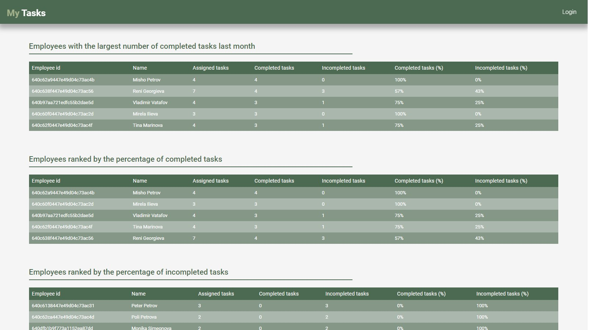
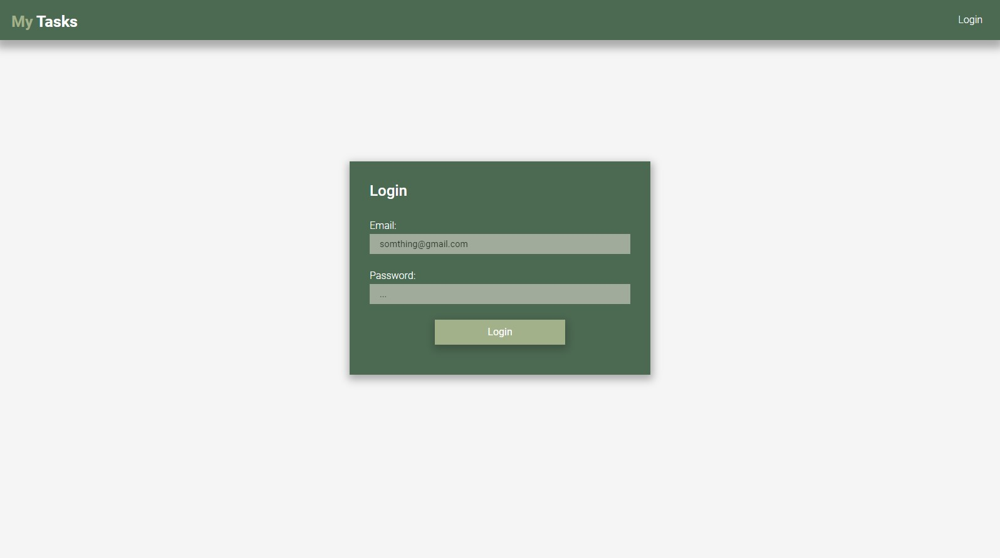
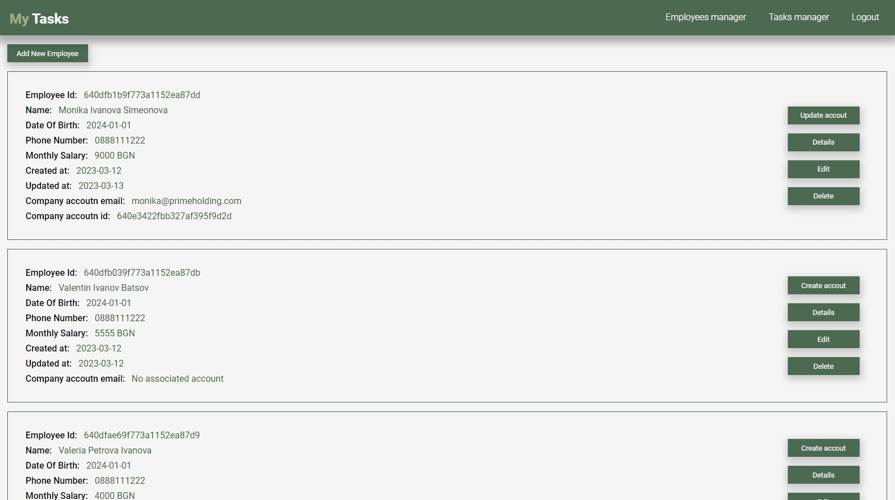
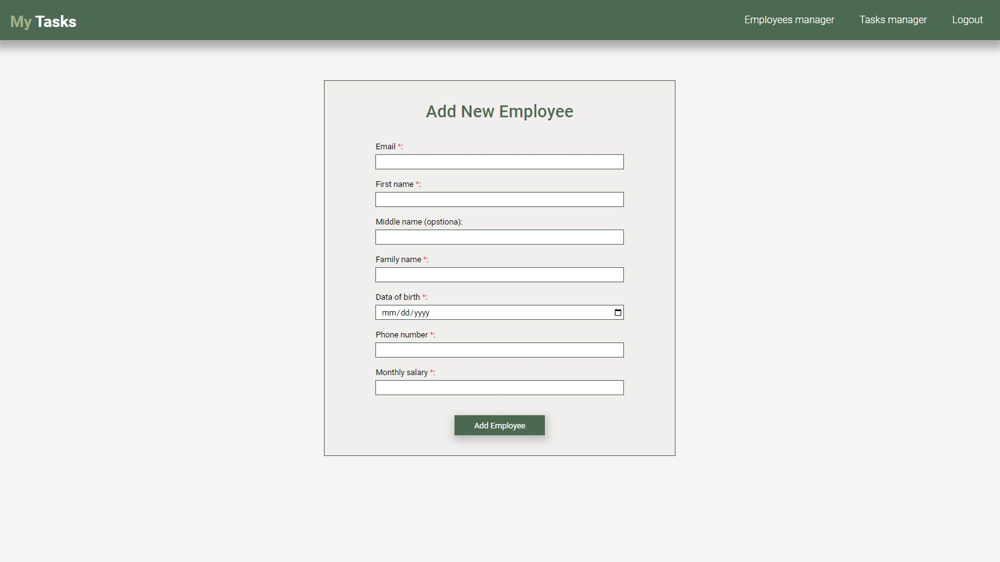
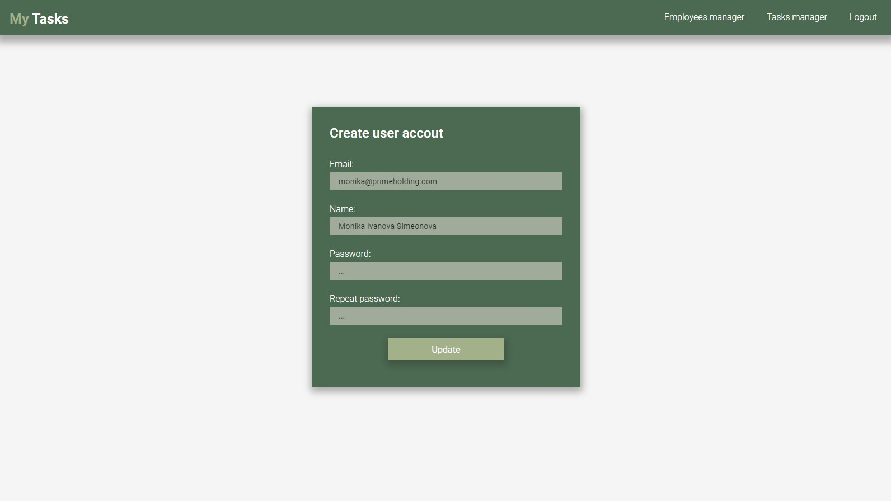
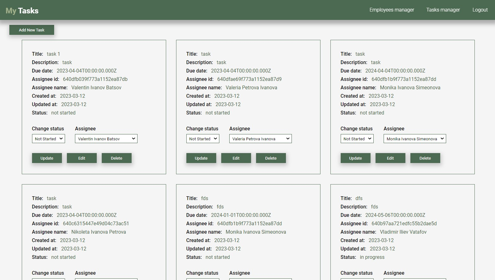
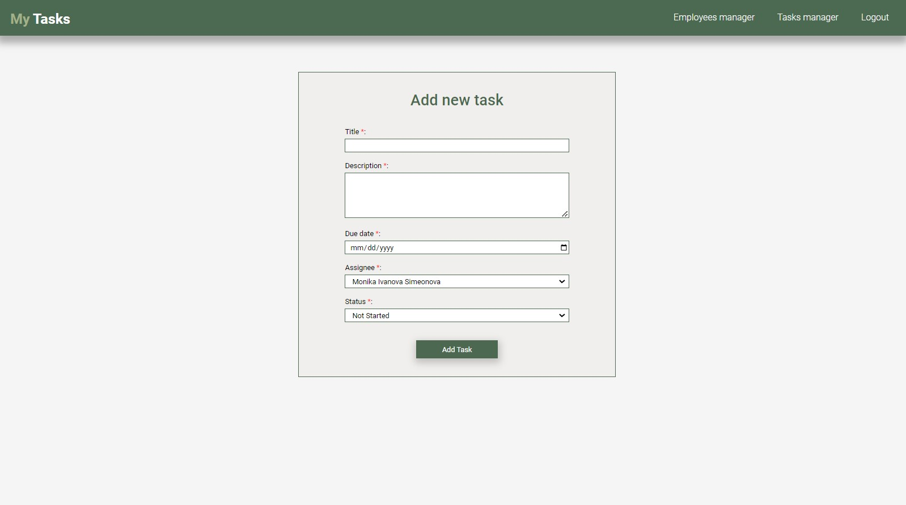
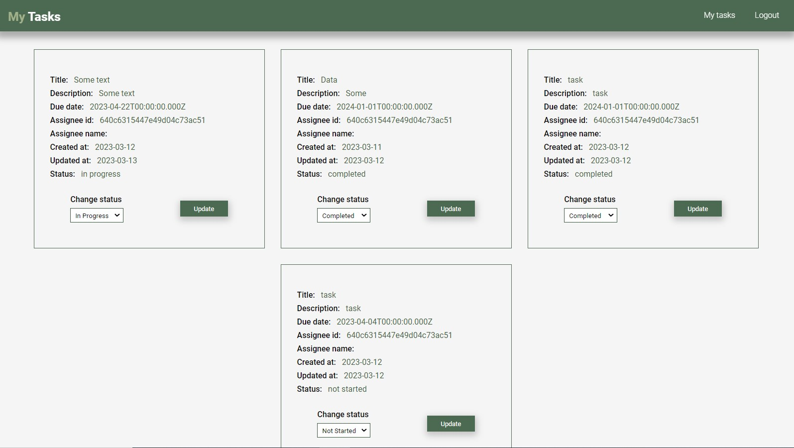
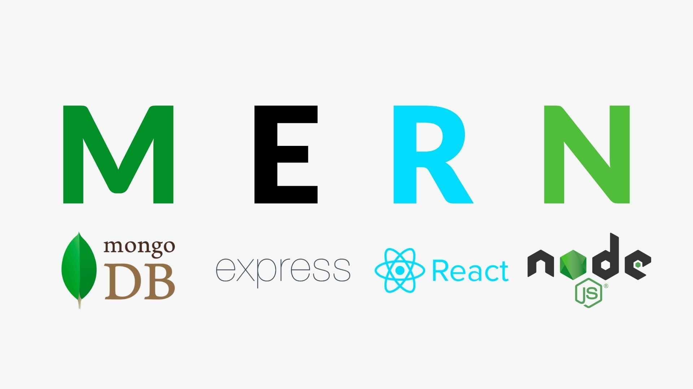

<h1 align="center"><i>My Tasks</i></h1>

My Tasks is a straightforward task management application built on the MERN stack. The application
  supports two types of accounts: administrator and employee. Administrators have the ability to create new employee
  records in the database and associate accounts with created employees. Additionally, administrators can create new
  tasks and assign them to employees.

The home page of the application displays three statistics tables that present the top and bottom
  employees based on various metrics.

  
  

  
  

  
  

  
  

  
  

  
  

  
  

  
  

<h4 align="center"><i>Stack: </i></h3>

  

    
  

  <h1 align="center">THE WHOLE APP IS CUSTOM!</h1>
  <h3 align="center">Built from scratch</h3>

  

**Features of the platform**

  

<b>Home page with statistics that present the top and bottom employees</b>

<b>Auth (Register, Login) with validations</b>

<b>Two type of accounts - administrator/user</b>

<b>Employees manager - employees listing</b>

<b>Create employee (admin only)</b>

<b>Book card:</b>

- <i>Update account (admin only)</i>
- <i>Edit employee data (admin only)</i>
- <i>Emplyee details (admin only)</i>
- <i>Delete employee (admin only)</i>

<b>Task manager (admin only) - tasks listing</b>

<b>Create task (admin only)</b>

<b>Task card:</b>

- <i>Update task - status and assignee (admin only)</i>
- <i>Edit task (admin only)</i>
- <i>Delete task (admin only)</i>

  

<b>The repo includes "<i>front-end</i>" and "<i>back-end</i>" of the app.

    Admin account:
    - username: ilia@primeholding.com
    - password: Qwerty1!

    User account:
    - username: nikoleta@primeholding.com
    - password: Qwerty1!

  <a href="./breef documentation/My-Tasks-Ilia-Vatafov.pdf">Breef documentations</a>

